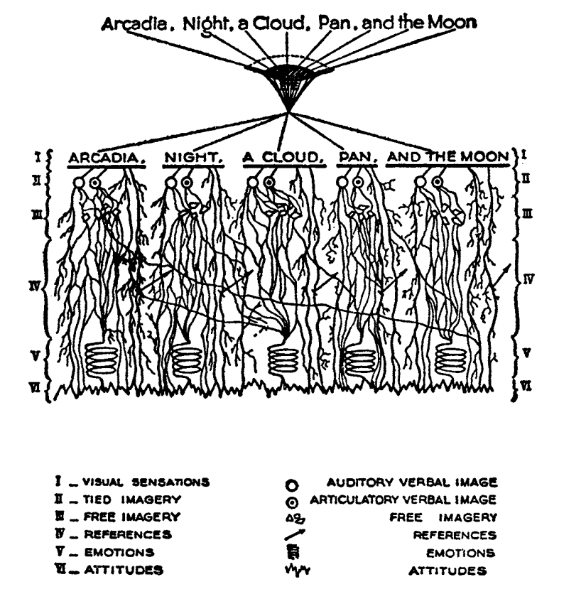

This is a series of claims, hypotheses, and suppositions, regarding images in text, as they appeared, and were conceived, at the turn of the twentieth century. This time in literary history is unusually appropriate to the study of textual images, as it coincides with the imagist school of poetry, and, as I will argue, other concurrent *imagisms*. These other imagisms, while in some cases influenced by the imagists, are not themselves a well-defined school, but rather a set of phenomena, which is roughly coextensive with what critics call modern poetry.

The period of literary history I'll be discussing here is strongly autoexegetic: much of the theory surrounding this phenomenon comes from the writers themselves, who are famous for—and often because of—their self-theorization. Of course, we must not be deluded into thinking that circumscribed explanations of poetry or fiction may be found in the theoretical writings of their creators. And this is especially true of the imagists, about whom it has often been noted that they do not always practice what they profess.<!--TODO: cite--> Perhaps they follow the dictum of Goethe's, which Yeats was fond of quoting, that "a poet needs all philosophy, but he must keep it out of his work" [@yeatsEssaysIntroductions1961 154]. Still, theories of images and their uses, from these writers and their contemporaries, will prove useful in generating hypotheses. That will help to show the centrality of the visual in the writing of this period, but also to provide questions that the coming quantitative analysis will hope to answer.

The selection of writers I discuss below is not an unassailably representative sample, but in addition to being concerned with the image, they are influential, and well-discussed among literary scholars today. Part of this is self-determined: the volume of their own critical output, as writer-critics, engenders more critical discussion. Some of the sounding-boards for this output---*The Egoist* for the imagists, for instance---not only provided a place to publish new creative works, or works-in-progress, but provided a forum for these writers to review each others' writing, and present thought on the state of the art. 

There exist a number of aspects to this topic which I will not consider here, either because they are beyond the scope of this brief survey, or because they are better treated in monographs devoted to the subject. One of the most crucial is intermediality. The development and popularization of photography and cinema during this period have been shown to have noticeable effects on its literature [@trotterCinemaModernism2007]. I will also not treat the mechanisms of influence at much length. Much has been made, for instance, about the influence of Chinese and Japanese poetry on Ezra Pound [@xie2015ezra; @pound2018cathay]. The influence of French symbolist poetry has also been treated at length [@taupinInfluenceFrenchSymbolism1985]. While some amount of genealogical work is necessary here, to show the flow and development of cetain ideas surrounding the image, those claims have been made most convincingly elsewhere [@levensonGenealogyModernismStudy1986 for example]. 

# Imagists: Flint, Pound, Lowell

The most obvious, if not always the best, sources of image theories are the writer/critics of the imagist school of poets. Brash, showy, and defiant in their rhetoric, these young poets at times seemed as interested in propagandizing their movement as participating in it. One of their most well-known statements is a sequence of two short notes in a 1913 issue of *Poetry*, the first by F.S. Flint, and the second by Ezra Pound [@flint1913]. Flint's begins with the tone of an investigative journalist, hot on the trail of the latest trend: "some curiosity has been aroused concerning *Imagisme*, and as I was unable to find anything definite about it in print, I sought out an *imagiste*, with intent to discover whether the group itself knew anything about the 'movement.' I gleaned these facts" (198--9). The irony is strong for us, if not for contemporaneous readers, since we know Flint to be an imagist himself.

In this short note, Flint names as imagist influences "the best writers of all time,"---Sappho, Catullus, and Villon. An unusual selection, it deserves some discussion. First, the poems of Sappho, a Greek poet whose work survives only in fragments, presents a model, however unintentional, of the imagists's fragmentary brevity. Some of her fragments, if treated as intentionally short poems, would be at home in an imagist anthology. Next, Catullus, as a neoteric poet, is known for his choices of quotidian, rather than epic, subjects, similar to those chosen by imagists. His best known work, known as Catullus 64, is told in an ekphrastic mode—a description of an image—and begins with the lines, here translated by Sir Richard Francis Burton in 1894: "Pine-trees gendered whilome upon soaring Peliac summit / Swam (as the tale is told) through liquid surges of Neptune" [@catullusValeriusCatullusCarmina]. Compare this with H.D.'s "Oread," which Pound cited as an exemplary imagist poem: <!--TODO: cite--> "Whirl up, sea— / whirl your pointed pines, / splash your great pines / on our rocks" [@1915some 28]. Catullus, who was also inspired by Sappho, was also well-known for his love poems, known as the "Lesbia poems," many of which are unapologetically explicit.^[Richard Aldington quotes from one of these poems in the epigraph of "Daisy" [@1915some 13]] François Villon, a late medieval balladeer, was similarly unapologetic in his choice of subject: as a career criminal, he often wrote of his exploits.

Of course, for every similarity between these ancient poets and their 20th Century admirers, there is a dissimilarity—even those that violate the rules which the imagists lay out in their prose writings. Sappho wrote chiefly metrically, even in her works of mixed meter, and Catullus, evoking Sappho, wrote in dactylls, as well. Villon's ballads seem the opposite, in form, of what Flint goes on to describe in the next paragraph. 

In a much-quoted passage, Flint lays out the "few rules, drawn up for their own satisfaction only," which the imagists had devised: "1. Direct treatment of the 'thing,' whether subjective or objective. 2. To use absolutely no word that did not contribute to the presentation. 3. As regarding rhythm: to compose in sequence of the musical phrase, not in sequence of a metronome" (199).

The first I take to mean, a kind of ekphrastic mode, but one in which there is little permeability between the metaphor and the emotion whose traditional, abstracted designations it illustrates. The second describes not only a certain economy of language, but a prohibition of certain categories of words, namely those which have no visual component. *Presentation* here is antecedent to re-presentation, and recalls forms of presentation in the plastic arts. It also elides agency: presentation is not fabrication, it is merely showing what is already there. This is a realist stance, which minimizes the role of the poet's imagination in the creation of the image.

The third aligns the imagists with the writers of *vers libre*, however weakly or tacitly. This is despite the editor's note to this essay, which is suspiciously insistent that "*Imagism* is not necessarily associated with Hellenistic subjects, or with *vers libre* as a prescribed form" [@flint1913 198]. The imagists here seem more anxious to define themselves as a *new* movement, in contradistinction to their precursors, that they seem unable to give unqualified admissions of their influences.

The essay that follows Flint's in this issue of *Poetry* is Ezra Pound's "A Few Don'ts by an Imagiste," an imagist *via negativa,* in which Pound largely defines the school according to what it is not—in Pound's terms, "Mosaic negative." He first, however, defines an "image" as "that which presents an intellectual and emotional complex in an instant of time." [-@pound1913 200]. This definition of image reveals a temporal component of the imagist conception of the image: an image presents not only an arrangement of objects or words, as a still-life painting might, but a frozen moment—a photograph or a film still, a dynamic scene rendered static.

Pound goes on to specify that he uses the term "complex" "rather in the technical sense employed by the newer psychologists, such as Hart" (200). The British psychologist Bernard Hart, in his work *The Psychology of Insanity* which appeared the previous year, explains the complex as "a system of connected ideas, with a strong emotional tone, and a tendency to produce actions of a certain definite character" [-@hart1912psychology 61]. The example Hart gives, tellingly, is a photography hobby which is driven by a "photography complex," (62).

As elsewhere in imagist propaganda, Pound defines the movement in terms of other media, and other genres. First, he cautions poets, "don't be descriptive; remember that a painter can describe a landscape much better than you can, and that he has to know a deal more about it" (203). It is unclear here whether Pound means that a painting "describes" a landscape, metaphorically, or that a painter, having painted the landscape, can describe it in prose much better than the poet.

At a basic level, it is hard for writing, imagist or otherwise, to avoid description in the strict sense of the word, when one of its primary processes is the conversion of visual information into text—a process necessarily involving description. But what Pound seems to mean by "description" here is closer to verbosity, or prosaic, adjective-laden ekphrasis. Yet paradoxically, he does not eschew prose, but aligns himself with it: "Don't retell in mediocre verse what has already been done in good prose. Don't think any intelligent person is going to be deceived when you try to shirk all the difficulties of the unspeakably difficult art of good prose by chopping your composition into line lengths" (201--2). This attention to generic distinctions—and to blurring them—is one which we shall see appear again and again in the writers I discuss below.

Elsewhere in Pound's essay, he repeats Flint's trio of imagist rules: linguistic precision, directness, and irregular rhythm. The following year, after Pound's leadership in the group was replaced with Amy Lowell's, she, too, lists rules, but ones that have been modified somewhat, and to which three more have been added. Lowell repeats the goals of rhythmic innovation, and of image "presentation." To this, she adds that "we are not a school of painters, but we believe that poetry should render particulars exactly and not deal in vague generalities" [@1915some vii]. Here again is an intermedial analogy, however, strangely, it is not the modern art of Wyndham Lewis, or the impressionism that inspired early Hulme, that provides the referent, but presumably a genre which values faithful representation.

"Exactitude," to Lowell, may be both a matter of language economy, but may also speak to specificity, and to scale. First, using the exact word might mean that one has hit the target in one shot, and can therefore stop shooting. However, since Lowell goes on to explain that "exact" means not "merely decorative," we can infer that "exact" here means something closer to "utilitarian." But what would constitute a "decorative" word? "Exact" might also refer to specificity—in linguistic terms, the hypernym level in the lexical hierarchy: *fir*, rather than *tree*. Specificity, then, is related somewhat to scale: *bough* instead of *tree*: a part-meronymic relation.

"We oppose the cosmic poet," Lowell says, on grounds of imprecision (vii). Imprecision here is a matter of scale. The astronomical scale is one which Lowell considers irrelevant to her, and the imagists' poetic interests. Several months later, in a special issue on imagism in *The Egoist*, Harold Monro accuses the poets of the school as being "so terrified at Cosmicism that they ran away into a kind of exaggerated Microcosmicism, and found their greatest emotional excitement in everything that seemed intensely small" [@monro1915 78]. This critique is seemingly confimed by the first poem in the anthology, Richard Aldington's "Childhood," whose central simile is that of a "chrysalis in a match-box" [@1915some 3]. Yet, the same poem parodoxically begins on what one might call a cosmic scale: "the wretchedness of childhood / Put me out of love with God. / I can't believe in God's goodness; / I can believe / In many avenging gods." While, in a sense, the speaker of Aldington's poem repudiates the cosmic, he yet engages with it.

It is an unanswered question whether Aldington, or any of the imagists, are really concerned with small things, whether they only seem so in contrast to prior poets, or whether they are in fact more concerned with the cosmos as their predecessors. An unanswered, perhaps, but not unanswerable question. Furthermore, we might ask: just how small is small? How do we know what a small object is, and what a big object is? Are these sizes relative to the size of human body? If so, which human bodies, precisely? When—under what circumstances, and at what sizes—does an object stop becoming an *thing* and become a collection of things, or a even a *place*?

<!--TODO: May Sinclair's response to Monro in the next issue: [@sinclairTwoNotes1915 88]] --> 

There are other physical or visual properties that Lowell here uses to describe the work in the second imagist anthology. One of the goals of the imagists, she says, is "to produce poetry that is hard and clear, never blurred nor indefinite." This word "hard" appears often in imagist rhetoric, and so it bears unpacking. While "hard" is obviously meant to be the opposite of "indefinite," as it is used in phrases like "hard left turn," "hard liquor," or "hard shadow," it also recalls physical properties of objects, like solidity, which Lowell might oppose to ethereality of a concept. Solidity is one of the properties which help to endow objects with objecthood: water and sand are not objects, and do not take indefinite articles, since they do not cohere enough to be handled as such.

In 1918, Pound publishes an article in *Poetry* called "The Hard and Soft in French Poetry" in which he explains these terms somewhat [@ezra1954literary 285]. I say "somewhat" because his explanation is hardly clear or satisfying: "by 'hardness' I mean a quality which is in poetry nearly always a virtue," he begins, " ... by softness I mean an opposite quality which is not always a fault." He continues, puzzingly, "anyone who dislikes these textural terms may lay the blame on Théophile Gautier, who certainly suggests them in *Emaux et Camées*; it is his hardness that I had first in mind. He exorts us to cut in hard substance, the shell and the Parian." He then goes on to name who, in French or, more often, in English poetry, who is "hard" and who is "soft": "since Gautier, Corbière has been hard, not with a glaze or parian finish, but hard like weather-bit granite. … Romains, Vildrac, Spire, Arcos, are not hard, any one of them" (288). At no point in the essay does he explain himself further.

Pound does, however, quote a few lines from Pierre-Joséph Bernard, an erotic poet, "praised by Voltaire," whom he explains has "clear hard little stanzas." The lines are from "l'Art d'aimer":

>| J'au vu Daphné, Terpsichore légère,
>|   Sur un tapis de rose et de fougère,
>|   S'abandonner à des bonds pleins d'appas,
>| Voler, languir… [@ezra1954literary 286]

It is hard to see what Pound could identify here as "hard," especially since the form and subject matter are so *légère*. It likely is related to the density, or in Lowell's phrase, "concentration" of the verses: the ratio of images or visual information carried to the syntax that carries them.

Pound uses another term in this essay which Lowell also uses to describe the imagists in her anthology: "clear." The "clear"/"blurred" dichotomy bears some examination. Lowell probably means lexical specificity, but chooses a visual metaphor, where objects are visible when they're focused by the mind's eye. But "clear" can also mean "transparent," or "unclouded"—is this poetic murkiness merely abstraction? And is clarity merely a richness of visual properties which can be inferred from the specificities of certain nouns and select adjectives?

Pound famously derided Edward Storer's poetry as "custard" in comparison with H.D.'s "Hellenic hardness" [quoted in @jones2001imagist 22]. Indeed, H.D.'s first poem in the second anthology begins, "you are clear, / O rose, cut in rock, / hard as the descent of hail" [@1915some 22]. It is not a coincidence that Pound's passage of Bernard is densely Hellenic—sculptural, even. Nor indeed that his analogies are to granite and to Parian, the marble used by the Greeks for sculptures. This substance appears again in Richard Aldington's poem "To a Greek Marble," the second poem in the first imagist anthology: "White grave goddess, / Pity my sadness, / O silence of Paros" [@a1914imagistes, 10]. The solidity, hardness, of the marble is what gives it objecthood, and distinguishes it from custard. It is also what makes it an *image*, that is, a word that has definite visual properties.

## Hulme
Although Pound later downplays it, one of his great influences, and where precursors of many of these ideas may be found, is in the philosophical writings of T.E. Hulme. A notorious anti-authoritarian, like Pound and many other imagists, he famously got "sent down" from Cambridge for unspecified "disturbances" [@jones2001imagist 161-2]. His "Notes on Language and Style" was probably written in 1907, although first published posthumously in 1925 (224). There, we find Hulme using "firm" and "solid" as descriptors for the kinds of books he promotes:

> Rising disgust and impatience with the talking books, e.g. Lilly and the books about Life, Science, and Religion. All the books which seem to be the kind of talk one could do if one wished.
>
> Rather choose those in old leather, which are *solid*. Here the man did not talk, but saw solid, definite things and described them. Solidity a pleasure. [@hulme98_selec 39]

Hulme contrasts "solidity" with "talk," which seems to support a reading of "hard" as not unsoft, but terse, economical. Unlike Pound, he does not reject description, but seems to see the writing process—at least that of "the man" who writes leatherbound books—as a process which begins with visual experience, is cognitively categorized into "definite things," and ends with description.

"Talk," for Hulme, is language which is abstracted, and at a remove from, sensory experience. He later explains this process in mathematical terms:

> …in algebra, the real things are replaced by symbols. These symbols are manipulated according to certain laws which are independent of their meaning. … An analogous phenomenon happens in reasoning in language. We replace meaning (i.e. *vision*) by words. These words fall into well-known patterns, i.e. into certain well-known phrases which we accept without thinking of their meaning, just as we do the *x* in algebra. [@hulme98_selec 37]

Hulme equates "meaning" with "vision," implying a primacy of visual experiences in the constructions of words. He also attributes clichés to habit and to thinking which takes place at a remove from vision. Later, he draws the distinction between *rhetoric* and *solid vision*:

>All emotion depends on real solid vision or sound. It is physical. But in *rhetoric* and expositional prose we get words divorced from any real vision. Rhetoric and emotion—here the connection is different. So perhaps literary expression is from *Real* to *Real* with all the intermediate forms keeping their *real* value." (38)

Hulme's conception of *rhetoric* seems to be a teleological, pragmatic prose which he opposes with an ateleological, or autotelic art centered around visual experience. Its use as a pejorative term among the imagists is treated at length in @gageArrestingEyeRhetoricc1981, and may be traced at least to Yeats's essay, "Emotion of Multitude," in which he famously calls rhetoric "the will trying to do the work of the imagination" [@yeatsEssaysIntroductions1961, 215]. 

Like Pound, Hulme he finds that prose is typically more aligned with his ideal poetic criteria than Romantic poetry.

> The contrast between (i) a firm simple prose, creating in a definite way a fairy story, a story of simple life in the country … Here we have the microcosm of poetry. The pieces picked out from which it comes. Sun and sweat and all of them. Physical life and death fairies. And (ii) on the other hand, genteel poetry like Shelley's, which refers in elaborate analogies to the things mentioned in (i). (39)

His use of "physical" is unusual for fairy-tale beings, but the paradox highlights the importance, for Hulme's poetics, of writing that evokes physical properties, meaning, usually, visual properties, as well: "sun" and "sweat" are not merely emblems---of happiness, hard work, or otherwise---but have discernible sizes, colors, and other visual properties.

In a later essay, "Romanticism and Classicism," probably written around 1911, Hulme draws the distinction between the two eponymous forces that he sees as opposing factors in cultural history. "After a hundred years of romanticism," he begins, "we are in for a classical revival" (71). Here, he disparages the habits of "the romantic," who, "because he thinks man is infinite, must always be talking about the infinite … The word infinite is in every other line. … In the classical attitude you never seem to swing right along to the infinite nothing" (71-2). Hulme might object to the use of the word "infinite" on grounds that the scale is irrelevant to human concerns, or that it's difficult to visualize: it has no visual properties.

Using terms Pound would later adopt, Hulme refers to the "classical attitude" as having "dry hardness":

> How many people now can lay their hands on their hearts and say they like either Horace or Pope? They feel a kind of chill when they read them. The dry hardness which you get in the classics is absolutely repugnant to them. Poetry that isn't damp isn't poetry at all. They cannot see that accurate description is a legitimate object of verse. Verse to them always means a bringing in of some of the emotions that are grouped round the word infinite. (75)

The "dry" / "damp" dichotomy here introduces a new figuratively physical set of poetic properties, as Hulme sees them. "Dry," when used of writing, usually means "boring": technical manuals are "dry." The OED gives, in sense 17 for "dry,": "deficient in interest; unattractive, distasteful, insipid. (figurative from food that wants succulency.)" [@DryAdjAdv]. Yet Hulme is certainly not suggesting that writing should be boring, or distasteful. The liquid, in his metaphor, might be emotion, or abstraction.

## Bergson 

Hulme's major philosophical influence, a French thinker whose books he often translated and reviews, was Henri Bergson. Besides being a well-known and widely-read philosopher of the period, his ideas appear often in the essays of this period's literary writers [@gilliesHenriBergsonBritish1996]. It is probably from Bergson that Hulme derives his ideas of instantenaity, and circumvention of the symbol in art. In Hulme's translation of Bergson's *An Introduction to Metaphysics*, we see this "direct treatment of the thing" explained:

>If there exists any means of possessing a reality absolutely instead of knowing it relatively, of placing oneself within it instead of looking at it from outside points of view, of having the intuition instead of making the analysis: in short, of seizing it without any expression, translation, or symbolic representation—metaphysics is that means. *Metaphysics, then, is the science which claims to dispense with symbols.* [@bergsonIntroductionMetaphysics1912 9, emphasis in the original.]

We hear in Bergson's metaphysics an attempt to escape the symbolic order through direct experience, direct "knowing" of "a reality," and direct "seizing" it, without mediation. It is *unmediated*, therefore *immediate*; *instant*, therefore *simultaneous*. His aesthetic theory, or theory of perception more generally, depends on the conception of subjectivities of time for which he is famous: the *temps / durée* dichotomy. Later, Bergson, through Hulme, explains his notion of the image, in similarly temporal terms: 

>Now the image has at least this advantage, that it keeps us in the concrete. No image can replace the intuition of duration, but many diverse images, borrowed from different orders of things, may, by the convergence of their action, direct consciosness to the precise point where there is a certain intuition to be suized. By choosing images as dissimilar as possible, we shall prevent any one of the from usurping the place of the intuition it is intended to call up, since it would then be driven away at once by its rivals." (ibid. 16)

Images are only discernible, Bergson seems to say, through contrast with their surroundings, and with each other. Though their dissimilarities, they produce an effect of immediacy, which Hulme echoes, then Pound, and then Eliot and other writers of this period.

## Gourmont

Many of Pound's conceptions of the image may also be traced to the French writer and critic Remy de Gourmont, whose work was often featured alongside imagists in *The Egoist*. In a 1915 article in *The Fortnightly Review*, Pound praises his "intelligence" for its "limpidity and fairness and graciousness, and irony, and a sensuous charm in his decoration when he chose to make his keen thought flash out against a richly-colored background" [@poundSelectedProse190919651973 413-23]. Although Pound does nod to Gourmont's attention to the senses, it is somewhat parodoxical, or at least self-contradictory, for Pound that he would praise anyone's writerly "decoration," after rejecting said decoration just previously in his writings on imagism. Richard Aldington, in a later review, praises him not for his use of images, by for the ways in which his philosophy permeates his creating writing. But most of all, Aldington highlights his antiauthoritarianism: his "philosophic anarchism," which was "too far-seeing to become imprisoned in a system" [@richardaldingtonLiteraryStudiesReviews1924 169]. "His thought," he warns, "is a kind of pungent acid under whose action social humbugs and moral shams dissolve." The force of this praise is the kind that lends credence to readings of these early modernist writers as proto-fascists<!-- TODO: cite -->. Yet Aldington, the imagists, and this period of literary history, see in Gourmont a figure whose thought promises the decisive break with tradition they wanted.

Gourmont's own description of his writing, and his instructions for good writing, is not only much more subdued, but helps to shed light on its visual properties, and the intermedial metaphors he uses to describe them:

> Écrire bien, avoir du style, … user d'un style « descriptif ou de couleur », c'est peindre. La faculté maîtresse du style, c'est donc la mémoire visuelle. Si l'écrivain ne voit pas ce qu'il décrit, ce qu'il raconte, paysages et figures, mouvements et gestes, comment aurait-il du style, c'est-à-dire, en somme, de l'originalité? Le peintre qui travaille « de chic » a devant les yeux la scène imaginaire qu'il traduit à mesure. De fort belles oeuvres ont été faites ainsi. Qui dit peintre, dit visuel. [@de1916problème]

Writing as painting, or more specifically, *describing* as painting, is an old an often-used analogy, but one which takes on new meaning in the age of such schools of painting as abstract expressionism and post-impressionism. It is no longer the writer's job to faithfully represent the visual experience of the narration, but just *a* visual experience, one which evokes the emotion felt by the writer.

## Richards

I.A. Richards, a literary critic before the professionalization of the field, and, along with T.S. Eliot, one of the members of the school of "new critics," also writes about image in text. A philosopher by training, and interested in psychology and cognitive sciences, many of his critical works exhibit systematic, if not scientific, approaches to literature. One such approach is found in his *Principles of Literary Criticism,* where he diagrams the process of reading a line of poetry, using this, which he calls a "hieroglyph" [@richards2003principles 106]:

He explains that the six distinct processes depicted vertically here are events happening one after the other, through which these lines are "streams of impulses flowing through in the mind" (113): 

>| I. The visual sensations of the printed words. 
>| II. Images very closely associated with these sensations.
>| III. Images relatively free. 
>| IV. References to, or 'thinkings of', various things. 
>| V. Emotions. 
>| VI. Affective-volitional attitudes. [-@richards2003principles 106-7]

To II, Richards adds that there are also "auditory images" associated with the visual sensations of words, and the mouth-feel sensations of subvocalization. To III, he notes that there are exceptions: "instances in plenty," he cautions, "may be found in which a full development of the sensory aspect of images is damaging to their effects" (113). 

Richards's schematic gives a sense of the complexity of the cognitive and emotional processes involved with reading words that bear visual significance. Not everyone produces mental images, as the psychological works covered in Chapter 1 attest, but images that readers produce are amalgamations of memories, emotions, attitudes, and sensations. 

## Moréas

Imagist rhetoric has its roots in a number of other poetic rhetorics. The symbolist movement is one such, well-documented influence [@taupinInfluenceFrenchSymbolism1985].  "The Symbolist Manifesto," as it is now known, Jean Moréas wrote and published in *Le Figaro* in 1886. In it, he declares symbolist poetry to be: 

>ennemie de l'enseignement, de la déclamation, de la fausse sensibilité, de la description objective," and that it looks to "vêtir l'Idée d'une forme sensible qui, néanmoins, ne serait pas son but à elle-même, mais qui, tout in servant à exprimer l'Idée, demeurerait sujette. [@vanierPremieresArmesSymbolisme1889 33-4]

Although symbolism is against "objective description," it yet seeks to convey ideas through the use of symbols: symbolist poetry is ideas clothed in the *sensory*. Although Pound insists that "imagism is not symbolism," the image as vehicle for emotion is suspiciously analogous to the symbol as clothes for the idea. In fact, much of what Flint says of imagism in *Poetry* he says of Symbolism earlier the same year. In his essay, "Contemporary French Poetry," he calls symbolism "a contempt for the wordy flamboyance of the romanticists" [@flintContemporaryFrenchPoetry1912, 355]. "Flamboyance" recalls Pound and Lowell's "ornament" or "decoration": words that can be removed without changing the meaning of the poem, or words which contribute nothing to the aim of the poem.

## Noguchi 

Another of these "foreign" influences—I use the term at a distance, since they always arrived heavily translated—was that of Japanese poetry. To choose one example, Yoni Noguchi, an influential Japanese writer who often wrote in English, and published widely in little magazines^[See @noguchi1916, where he introduces the "hokku" poem to readers of *The Egoist* in 1916, and a review of his work in @andersonLittleReview1915 45] begins his *Art of Japanese Poetry* with a statement about economy of words that would sound at home in Pound or Lowell:

> I come always to the conclusion that the English poets waste too much energy in 'words, words, words,' and make, doubtless with all good intentions, their inner meaning frustrate, at least less distinguished, simply from the reason that its full liberty to appear naked is denied. [@noguchi1914spirit 15].

Is "naked" poetry that which is not clothed in the way that Moréas suggests, namely, at a symbolic or metaphorical remove from "the thing itself"? Is it simply poetry with fewer function words, or fewer abstractions? Is it a coincidence that Noguchi's reference is to Hamlet, which Eliot later singles out for its anti-imagistic wordiness? 

## T.S. Eliot and the Objective Correlative

An influential poet/critic of this period, and a friend of Pound, Woolf, and other imagists, is T.S. Eliot. In his 1919 review of J.M. Robertson's *The Problem of "Hamlet,"* he sketches his theory of the "objective correlative," a notion which shares properties with the imagist "image" [@eHamletHisProblems1919]. Scholars have often noted that Eliot's is by no mean a new conception, as it is found in many other critics and philosophers, but has a few unique properties [@frankEliotObjectiveCorrelative1972 311]. In his essay, Eliot contrasts these lines of Hamlet, Act I—"look, the morn, in russet mantle clad / Walks o'er the dew of yon high eastern hill"—with a few "quite mature" but "unstable" lines from Act V—"Sir, in my heart there was a kind of fighting / that would not let me sleep" [@eHamletHisProblems1919 941]. The latter is probably what he earlier calls Shakespeare's "superfluous and inconsistent scenes which even hasty revision should have noticed." This is pure imagism. Its insistence on revision for concision, distaste for abstractions (if we read "instable" as opposite to "concrete") and preference for visual information are all found in the imagist propaganda of Pound, Flint, and Lowell. Furthermore, the quote from Hamlet is also Pound's, from "A Few Don'ts." Although where Pound doesn't quite get the quote right, revising it to "dawn in russet mantle clad," Eliot does. They both, however, attribute these lines to "Shakespeare," rather than to his character Horatio, effectively hiding an easy explanation for the contrast between these two passages: differences in character speech patterns---Hamlet is much more given to abstraction than Horatio.

In explaining his reasons for what he considers the "failure" of Hamlet, Eliot announces that:

> The only way of expressing emotion in the form of art is by finding an "objective correlative"; in other words, a set of objects, a situation, a chain of events which shall be the formula of that *particular* emotion; such that when the external facts, which must terminate in sensory experience, are given, the emotion is immediately evoked." (941)

Again, we hear the echo of Pound's theory of images as emotional expressions, and Pound and Lowell's calls for particularity. Perhaps more importantly, we see the expansion of the imagist definition of Pound's to include "events," which adds a Bergsonian temporal dimension to the earlier notion of image. 

## Yeats

William Butler Yeats, an inspiration to the imagists, and with whom Pound worked closely, often writes of poetic practice in terms of its sister arts, or using analogies derived from the plastic arts. In an early essay, "What is Popular Poetry?", he writes of his desire for a new national poetry, "which would not be an English style and yet would be musical and full of colour" [@yeatsEssaysIntroductions1961 3]. What Yeats means by "colour" here might be closer to its use in the expression "local color," rather than literal colors, but it still speaks to a visual dimension to his ideal poetry. 

In a later essay, "The Symbolism of Poetry," Yeats praises Arthur Symons's critical work, *The Symbolist Movement in Literature,* a seminal work for many imagists. In it, he shows what he means by "symbolism," and illustrates it with two lines from Burns: "the white moon is setting behind the white wave, / and Time is setting with me, O!". Those lines, he claims,

> are perfectly symbolical. Take from them the whiteness of the moon and of the wave, whose relation to the setting of Time is too subtle for the intellect, and you take from them their beauty. But, when all are together, moon and wave and whiteness and setting Time and the last melancholy cry, they evoke an emotion which cannot be evoked by any other arrangement of colours and sounds and forms. We may call this metaphorical writing, but it is better to call it symbolical writing, because metaphors are not profound enough to be moving, when they are not symbols, and when they are symbols they are the most perfect of all… [@yeatsEssaysIntroductions1961 155-6]

While "whiteness" is not *entirely* too subtle for the intellect—it recalls the white hair of old age, for one—it shows that, for Yeats, the visual properties of poetic images are what allow them convey the otherwise ineffable, and what allow them to draw analogies across unrelated domains. 

# Joyce

Pound anthologized James Joyce's poem "I Hear an Army" in *Des Imagistes*, making him an imagist after the fact. An eerie coincidence is that, although the army of its title might be as just an elaborate metaphor, the anthology was published in February 1914, just four months before the outbreak of the first world war. The poem was reprinted from Joyce's 1907 collection, *Chamber Music*. In an untitled fragment from a notebook from a few years prior, Joyce muses on the relation of the image with art, both plastic and literary, using a quasi-Vergilian taxonomy:

> There are three conditions of art: the lyrical, the epical and the dramatic. That art is lyrical whereby the artist sets forth the image in immediate relation to himself; that art is epical whereby the artist sets forth the image in mediate relation to himself and others: that art is dramatic whereby the artist sets forth the image in immediate relation to others. [@joyceCriticalWritings2018 122-3]

By this definition, imagism sees itself as lyric, with images presented in immediate relation to the artist. The Bergsonian immediacy is present here again. Joyce's use of "sets forth" also recalls Pound's "presents": the aim of the poet is not to interpret, to persuade, or to orate, but merely to *set forth*. This does not, and cannot, obviate mediation, or symbolic functions, but it is a stance toward that process which seeks to hide it. 

## Woolf

Virginia Woolf was another modernist writer/critic, involved in not only producing modern writing, but theorizing it. Her 1926 essay "The Cinema," although ostensibly discussing the new artistic medium, ends with a discussion of what she knows best: fiction. She is interested here in the interface between the thought and the image, imaginal image and literary image.

> For what characteristics does thought possess which can be rendered visible to the eye without the help of words? It has speed and slowness; dart-like directness and vaporous circumlocution. But it has also an inveterate tendency especially in moments of emotion to make images run side by side with itself, to create a likeness of the thing thought about, as if by so doing it took away its sting, or made it beautiful and comprehensible. In Shakespeare, as everybody knows, the most complex ideas, the most intense emotions form chains of images, through which we pass, however rapidly and completely they change, as up the loops and spirals of a twisting stair. [@woolf2009selected 252-3]

Here, for Woolf, literary art serializes what thought presents in parallel: it transforms images that "run side by side" into "chains of images." Her spiral staircase analogy recalls the gyres of Yeats's "The Second Coming," of 1919 and the Vorticism of Lewis and Pound, of a few years earlier. It is at once dizzying and transporting. Her example of image-thick writing in Shakespeare appears again in her later essay, "How Should One Read a Book." But there, she elaborates on the quality of the image:

>reading poetry often seems a state of rhapsody … and we read on, understanding with the senses, not with the intellect, in a state of intoxication. Yet all this intoxication and intensity of delight depend upon the exactitude and truth of the image, on its being the counterpart of the reality within. Remote and extravagant as some of Shakespeare's images seem, far-fetched and etheral as some of Keats's, at the moment of reading they seem the cap and culmination of the thought; its final expression. [@woolf2009selected 131-2]

We hear the echo of the imagists' "precision" here in Woolf's "exactitude and truth." The ambiguity in *truth*, straddling an arrow's true flight and the opposite of a lie, allows Woolf to hint that the literary image should be both representationally accurate to the thought, and mimetically accurate to the real-world referent. Like Eliot's objective correlative, the image corporializes the thought, gives it body.

# Summary

We have seen a number of definitions, descriptions, or explanations, of images in text. Here is a list of hypotheses gathered, or derived, from the criticism examined above. I do not espouse any of these, at this stage, but list them merely as hypotheses, many of which may be tested, translated into testable form, or otherwise analyzed.

1. Images are free of decoration and ornament—"dry." We might construe decoration as as a term or set of terms both extrinsic to the information conveyed by the syntactic frame, and possessing also some other redeeming value, whether as a pleasant sonic quality or other similar property.
2. Images convey visual information, such as color, shape, size, or space. This visual information is well-defined, that is, carries "hard" boundaries.
3. Images represent, or convey, an "emotional complex"—they must be translatable into human emotion. Therefore, they would need to interact on some level with the human scale, and with human conceptions of objects.
4. Images represent events or experiences: occurrences in time. They do not always take place in time, but are suggestive of the passage of time. A skein of silk blown against a wall, as in Pound's poem "The Garden," holds within it a kind of potential energy: the silk will fall, and so the image contains within it the suggestion of a future movement through time.
5. Images, as seen, as written, as read, as experienced, and as imagined, are all distinct entities from one another, yet analogous. The media of each condition their potential properties. They are interdependent, and are in some cases translations of each another.
6. Imagism is not symbolism, as Pound argues, and thus images are not symbols. Images are "more than an idea," according to Eliot. Yet images, like all language, cannot fully escape the symbolic order, either, and to claim that they achieve this is a form of rhetoric that reveals its political dimensions.
7. Image-rich writing has more in common with "good prose," as Pound puts it, than with other, non-imagist poetry.
8. Images, at least as understood by the imagists, share affinities with Chinese and Japanese poetry, and with French symbolist poetry.
9. Images employ, if they are not synonymous with, *les mots justes*. This expression speaks to the specificity of a word, but also implies a *telos*. To be appropriate to something—a feeling, event, task, scene—the poem must be oriented toward the expression of that thing.
11. Images are usually metaphors, and sometimes metonymy, but rarely similes. They juxtapose emotional experiences with correlatives, objective and subjective, but they attempt to erase their connections. 
10. Images convey their intended emotions through juxtaposition. Juxtaposition presupposes pairwise comparisons (more than two at a time would be an assemblage), objecthood (for things to be juxtaposed, they must first be things), and difference (two things are not juxtaposed if they are identical, or naturally conjoined).

It will be the task of the following chapters to test these claims.

# Works Cited
